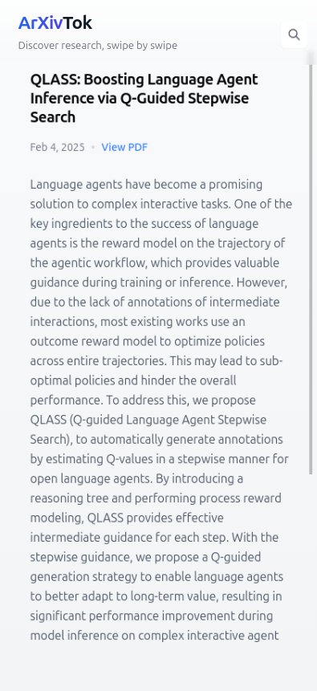

# ArxivTok 📚

A TikTok-style interface for browsing ArXiv papers. Built with SolidJS and TailwindCSS.



## Features

- 📱 TikTok-style vertical swipe interface
- 🔍 Real-time paper search
- 💫 Smooth animations and transitions
- 📱 Fully responsive design
- 🎨 Apple-inspired UI/UX
- 🔄 Infinite scroll loading
- 🔎 Smart search suggestions
- 📱 Touch-optimized for mobile devices

## Tech Stack

- [SolidJS](https://www.solidjs.com/) - Core framework
- [SolidStart](https://start.solidjs.com/) - Meta-framework
- [TailwindCSS](https://tailwindcss.com/) - Styling
- [ArXiv API](https://arxiv.org/help/api/) - Data source

## 🚀 Quick Start

1. Clone the repository
```bash
git clone https://github.com/yourusername/arxivtok.git
cd arxivtok
```

2. Install dependencies
```bash
npm install
# or
pnpm install
# or
yarn install
```

3. Start the development server
```bash
npm run dev
# or
pnpm dev
# or
yarn dev
```

4. Open [http://localhost:3000](http://localhost:3000) with your browser to see the result.

## 🛠️ Development

### Prerequisites

- Node.js 16.x or higher
- npm, yarn, or pnpm
- Git

### Project Structure

```
arxivtok/
├── src/
│   ├── components/    # React components
│   ├── lib/          # Utility functions and API calls
│   ├── routes/        # Page components and routing
├── public/           # Static files
└── tests/           # Test files
```

## 🧪 Testing

Run the test suite:

```bash
npm test
# or
pnpm test
# or
yarn test
```

## 🤝 Contributing

We love your input! We want to make contributing to ArxivTok as easy and transparent as possible, whether it's:

- Reporting a bug
- Discussing the current state of the code
- Submitting a fix
- Proposing new features
- Becoming a maintainer

### Pull Request Process

1. Fork the repo and create your branch from `main`
2. If you've added code that should be tested, add tests
3. If you've changed APIs, update the documentation
4. Ensure the test suite passes
5. Make sure your code lints
6. Issue that pull request!

## 🐛 Known Issues

See the [Issues](https://github.com/miguel07alm/arxivtok/issues) page for a list of known issues.

## 📦 Dependencies

- solid-js: ^1.x
- tailwindcss: ^3.x
- xml2js: ^0.6.x
- See [package.json](package.json) for full list

## 🎯 Performance

ArxivTok is optimized for performance:
- Server-side rendering for fast initial load
- Lazy loading of paper content
- Efficient data caching
- Optimized touch interactions


## 💭 Acknowledgments

- Thanks to ArXiv for providing the API
- The SolidJS team for the amazing framework
- All our contributors and supporters

## 📄 License

MIT License - See the [LICENSE](LICENSE) file for details.